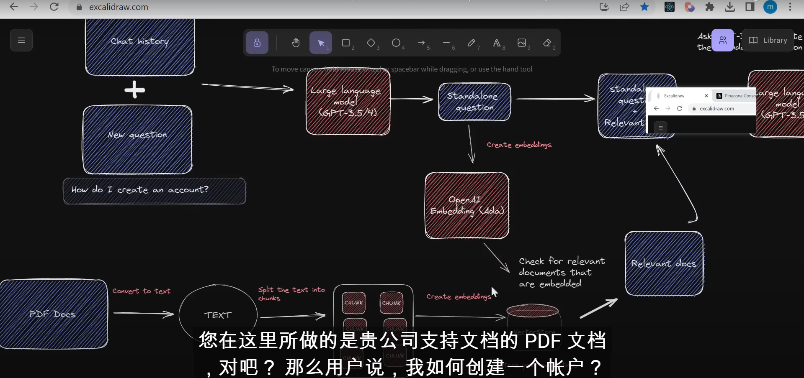

# langchain  gpt 处理文档数据流程

[mayooear/gpt4-pdf-chatbot-langchain: GPT4 &amp; LangCh](https://github.com/mayooear/gpt4-pdf-chatbot-langchain)

[ain Chatbot for large PDF docs --- mayooear/gpt4-pdf-chatbot-langchain：GPT4 &amp; LangChain Chatbot for Large PDF docs (github.com)](https://github.com/mayooear/gpt4-pdf-chatbot-langchain)

UnstructuredPaddlePDFLoader

#### es7 向量相似度搜索 用的什么算法

ES7 向量相似度搜索通常使用的算法之一是"近似最近邻居搜索"（Approximate Nearest Neighbors，简称ANN）算法。ANN 算法的目标是在高维向量空间中高效地找到与给定查询向量相似的近邻向量。一些常用的 ANN 算法包括：

1. **LSH（局部敏感哈希）** ：LSH 算法通过哈希函数将相似的向量映射到相同的桶中，从而快速查找相似的向量。它在高维空间中表现良好。
2. **k-d 树** ：k-d 树是一种二叉树结构，用于分割数据空间，从而进行高效的近似搜索。它适用于低维度空间。
3. **HNSW（层次式导航无序搜索）** ：HNSW 是一种层次式图结构，可用于高维向量的近似搜索。它通过构建多层图来加速搜索。
4. **FAISS** ：FAISS 是一个专门用于向量相似度搜索的库，它包括多种ANN算法的实现，如IVF、PQ、OPQ等，可根据需求选择合适的算法。

不同的应用和需求可能选择不同的算法来执行向量相似度搜索，具体的选择取决于数据维度、索引构建时间、查询响应时间等因素。因此，你可以根据具体情况来选择最适合你的算法。

#### ANN 跟KNN的区别

ANN（Approximate Nearest Neighbors）和 KNN（K-Nearest Neighbors）都涉及到近似最近邻居搜索，但它们有一些关键区别：

1. **精确性 vs. 近似性** ：

* **KNN** 是一种精确的搜索方法。它会计算查询点与数据集中所有点的距离，然后选择距离最近的 k 个点作为最近邻居。这意味着它会返回确切的结果，但在大规模数据集上的计算成本很高。
* **ANN** 是一种近似的搜索方法。它旨在以较低的计算成本找到接近最近邻居的点，但不一定是确切的最近邻居。因此，它可以在更大的数据集上更高效地工作，但可能会牺牲一些精确性。

1. **计算成本** ：

* **KNN** 需要计算查询点与数据集中所有点的距离，这在大规模数据集上可能非常昂贵，尤其是高维数据。
* **ANN** 使用一些特殊的数据结构和算法，如哈希函数、树结构等，以减少计算成本，使得在大规模数据集上更高效。

1. **应用场景** ：

* **KNN** 通常在数据集相对较小且对精确性要求高的情况下使用，例如图像分类、推荐系统等。
* **ANN** 更适用于大规模数据集和对精确性要求相对较低的应用，如相似性搜索、数据降维、聚类等。

1. **搜索时间** ：

* **KNN** 的搜索时间取决于数据集大小，因此在大型数据集上可能非常慢。
* **ANN** 通过使用近似方法，通常能够在相对较短的时间内返回结果，特别是在高维数据的情况下。

总之，KNN 是一种精确的最近邻搜索方法，适用于小型数据集和对精确性要求高的任务。而ANN 是一种近似的最近邻搜索方法，适用于大规模数据集和对精确性要求相对较低的任务，以换取更高的搜索效率。选择哪种方法取决于你的具体应用需求和计算资源。

### es跟kabana的安装，当磁盘达到警戒线时，kabana启动失败！！！！！！ 或出现多次重试问题。

[ElasticSearch8 8.3.0 安装 + kibana8.3.0 linux系统安装详细流程_linux部署elasticsearch8+kibana8_矮小的的博客-CSDN博客](https://blog.csdn.net/crazyo2jam/article/details/125533281)

浏览器版本问题，也会导致kibana页面无法显示
