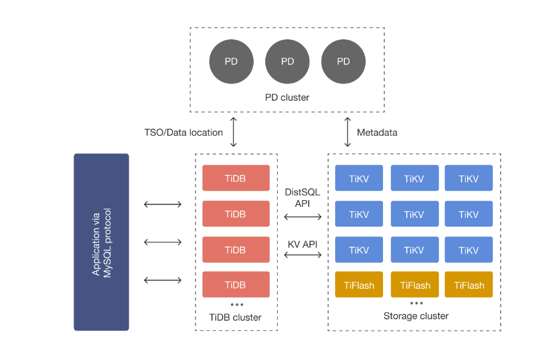

# 问题集锦

## 统计信息收集不及时导致执行计划偏差

*统计信息在每日凌晨触发，每天会有大批数据入库，此时针对大批数据入库表进行查询，发现执行计划偏差*

### 前置知识

在 TiDB（分布式数据库系统）中，"Region" 是一个核心的概念，用于对数据进行分片和分布式存储。每个 Region 包含了特定范围的数据，这些数据被按照一定规则划分并分布在 TiKV（TiDB 中的分布式键值存储引擎）集群的各个节点上。

以下是关于 TiDB Region 的一些关键信息：

1. **数据分片：** TiDB 将数据划分成不同的 Region，每个 Region 包含一定范围的数据。这样的设计有助于水平扩展，提高系统的性能和容量。
2. **Region Leader 和 Follower：** 在每个 Region 中，有一个节点被选为 Leader，负责处理该 Region 的读写请求，其余的节点则作为 Follower。Follower 节点通过与 Leader 节点保持同步，以提供数据的冗余备份和高可用性。
3. **Region 分裂：** 随着数据的不断插入，Region 可能会变得过大，为了保持负载均衡和性能，TiDB 会自动触发 Region 的分裂操作，将一个大的 Region 分成两个更小的 Region。这样可以确保数据在整个 TiKV 集群中得到均匀分布。
4. **Placement Driver (PD)：** PD 是 TiDB 集群中的一个组件，负责管理整个集群的拓扑信息，包括 Region 的分配和调度。
5. **Raft 协议：** TiDB 使用 Raft 分布式一致性协议来保证 Region 的数据一致性。Raft 协议通过选举机制确保了每个 Region 的 Leader 节点可用，并保证数据的持久性。

总体而言，TiDB 的 Region 概念是其分布式架构中的关键组成部分，有助于实现水平扩展、高可用性和数据分布的均衡。 Region 的自动分裂、Leader 选举以及 PD 的调度等机制使 TiDB 成为一个适用于大规模分布式环境的数据库系统。

### 统计信息收集逻辑

* *表的总行数，列的等深直方图，Count-Min Sketch，Null 值的个数，平均长度，不同值的数目等等。*
* 在执行 analyze 语句的时候，TiDB 会将 analyze 请求下推到每一个 Region 上，然后将每一个 Region 的结果合并起来
* 等深直方图 做范围查询、Count-Min Sketch做等值查询
* 目前 TiDB 的统计信息还是以单列的统计信息为主，为了减少独立性假设的使用，在将来 TiDB 会探索多列统计信息的收集和维护，为优化器提供更准确的统计信息

### 执行计划执行逻辑

以session为维度存储执行计划缓存，lru淘汰机制。

如果发现某一组 `Prepare`/`Execute` 由于执行计划缓存导致了非预期行为，可以通过 SQL Hint `ignore_plan_cache()` 让该组语句不使用缓存。即explain跟实际不一致

[Prepare 语句执行计划缓存 | PingCAP 文档中心](https://docs.pingcap.com/zh/tidb/stable/sql-prepared-plan-cache)

#### 执行计划缓存

执行计划缓存是数据库系统中的一个重要概念，用于存储先前执行过的查询的执行计划，以便在后续相同或类似查询的情况下能够重用已经计算好的执行计划，从而提高查询性能。

具体来说，执行计划缓存有以下特点和作用：

1. **缓存执行计划：** 当数据库系统接收到一个查询请求时，它会首先检查查询的执行计划是否已经存在于执行计划缓存中。如果存在匹配的执行计划，数据库可以直接使用缓存中的计划，而不需要重新进行解析和优化。
2. **减少查询优化开销：** 查询优化是一个复杂的过程，涉及到解析 SQL 查询、生成查询计划、选择合适的索引等。通过执行计划缓存，数据库可以避免重复进行相同查询的优化过程，从而减少系统开销。
3. **提高查询性能：** 通过避免重复的查询优化工作，执行计划缓存能够显著提高查询性能，尤其是对于频繁执行的查询或相同查询模板的情况。
4. **基于哈希匹配：** 执行计划缓存通常使用哈希表或类似的数据结构来实现。查询的 SQL 语句或相关信息被哈希计算，作为缓存的键，执行计划则作为值。这样可以快速检索并匹配缓存中的执行计划。
5. **自动失效和更新：** 执行计划缓存可以实现自动失效机制，即当数据库的表结构发生变化（例如添加、删除索引）时，缓存中的执行计划将失效，并在下一次查询时重新生成。

需要注意的是，执行计划缓存的实现和管理可能因不同的数据库系统而异。一些数据库系统可能提供手动刷新缓存、设置缓存大小的配置选项，而另一些数据库系统可能采用自动管理的方式。在某些情况下，执行计划缓存可能也会导致问题，例如由于缓存膨胀而占用过多内存，或者由于执行计划的变化而导致缓存命中率下降。因此，在使用执行计划缓存时，需要根据具体的应用场景和数据库系统的特性进行适当的配置和管理。

#### 大批量数据插入，统计信息可能存在延迟，执行计划不会触发重新生成，用的还是之前缓存的执行计划

在一些数据库系统中，当新增大批量数据时，会触发数据库统计信息的更新，这可能导致执行计划的失效和重新优化。然而，在 TiDB 中，新增大批量数据不一定会立即触发执行计划的更新，因为 TiDB 的执行计划缓存管理机制可能会在一定程度上延迟失效的处理。

以下是一些相关的情况和解释：

1. **自动失效机制：** TiDB 会定期地检查表的统计信息，并在发现统计信息发生变化时，标记相关的执行计划为失效。这意味着新增大批量数据后，统计信息可能在一段时间后被检测到，并触发执行计划的失效。
2. **延迟更新：** 为了降低对生产环境的影响，TiDB 可能采用延迟更新的方式，不会立即更新所有的执行计划。这是为了避免在数据变动频繁的情况下造成过多的执行计划失效和重新优化，从而减轻系统开销。
3. **手动触发：** 如果需要确保在新增大批量数据后立即更新执行计划，可以考虑使用 `ANALYZE TABLE` 语句手动触发统计信息的收集和执行计划的失效。

总体而言，TiDB 会通过自动机制检测表的统计信息的变化，并在必要时触发执行计划的失效。但由于延迟更新和自动触发机制的存在，可能不会立即在数据新增时就导致执行计划的失效和重新优化。在某些情况下，可能需要手动触发统计信息的更新，以确保最新的数据分布信息被纳入执行计划的优化考虑。

#### 如何关闭TIdb执行计划缓存

在 TiDB 中，默认是开启执行计划缓存的。执行计划缓存的开启和关闭可以通过 TiDB 的配置文件进行调整。以下是一些与执行计划缓存相关的配置项，你可以根据需要进行调整：

1. **缓存开启和关闭：**
   * `plan_cache_enabled` 是一个布尔类型的配置项，用于开启或关闭执行计划缓存。
   * 设置为 `true` 表示启用缓存，设置为 `false` 表示关闭缓存。
2. **缓存大小：**
   * `plan_cache_size` 配置项用于指定执行计划缓存的大小，以字节为单位。
   * 缓存大小的设置影响可以缓存的执行计划数量。
3. **缓存失效时间：**
   * `plan_reuse_policy` 配置项用于设置执行计划缓存的失效策略。常见的值有 `reuse` 和 `never`。
   * `reuse` 表示根据 `plan_cache_eviction_life_time` 来设置缓存的失效时间。
   * `never` 表示永远不失效。
4. **缓存失效时间设置：**
   * `plan_cache_eviction_life_time` 配置项用于设置执行计划缓存的失效时间，单位是毫秒。
   * 该配置项在 `plan_reuse_policy` 设置为 `reuse` 时生效。

如果你想关闭执行计划缓存，可以按照以下步骤进行：

1. 打开 TiDB 的配置文件（通常是 `tidb.toml`）。
2. 找到 `plan_cache_enabled` 配置项，并将其设置为 `false`。
3. 保存配置文件。
4. 重启 TiDB 服务，使配置生效。

请注意，在关闭执行计划缓存后，TiDB 将不再缓存执行计划，可能会导致一些查询性能上的损失。因此，在关闭执行计划缓存之前，请确保了解其影响，并根据实际情况进行决策。

#### explain 执行计划跟实际执行计划不一致

You

为什么直接explain sql语句能走索引，实际执行sql却无法走索引

ChatGPT

在 MySQL 或其他数据库系统中，`EXPLAIN` 语句用于获取查询的执行计划，以便了解数据库是如何执行查询的。`EXPLAIN` 不会真正执行查询，而只是模拟执行计划，给出一个预估的执行路径。

有时候，`EXPLAIN` 的结果可能显示查询可以使用索引，但在实际执行 SQL 语句时却无法走索引。这可能是由于以下一些原因：

1. **统计信息不准确：** `EXPLAIN` 使用的是统计信息来生成执行计划。如果统计信息不准确或者过时，`EXPLAIN` 的执行计划可能与实际情况不符。可以考虑手动更新统计信息，例如使用 `ANALYZE TABLE` 命令。
2. **缓存：** 有时候执行计划可能会被缓存，`EXPLAIN` 可能是从缓存中获取的。而实际执行 SQL 时可能没有命中缓存，导致选择的执行计划不同。
3. **SQL 指令不同：** 在使用 `EXPLAIN` 时，SQL 查询并没有真正地执行，因此优化器可能会在生成计划时考虑不同的情况。在实际执行时，数据库可能根据运行时的参数和数据分布等因素选择了不同的执行计划。
4. **并发情况：** 在高并发的情况下，实际执行时可能有其他查询正在执行，导致执行计划的选择受到影响。

为了更好地理解为何执行计划不同，可以考虑使用 `SHOW WARNINGS` 命令获取更详细的执行信息。此外，通过查看表的索引、统计信息，并手动分析查询条件和 SQL 的复杂度，可以更好地理解为什么某个查询可能无法走索引。

最终，调整统计信息、缓存的使用、SQL 查询的复杂度和索引的设计都是优化查询性能的方向。

### mysql为什么没有触发这类问题，其统计信息的收集跟此类有何不一样

mysql不同的sql没有执行计划的缓存，tidb有执行计划的缓存。

### 解决方案

* 在大数据量更新的情况下，手动触发统计信息
* 分区是为了更好的删除数据，尽量采用单表
* 关闭执行计划缓存，每次重新生成
