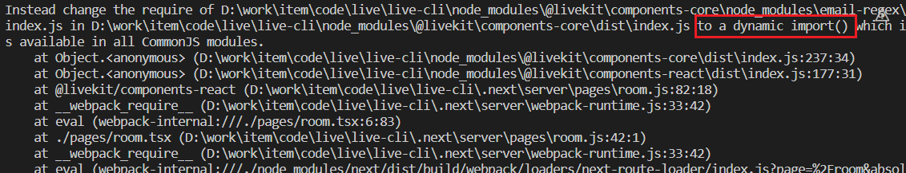
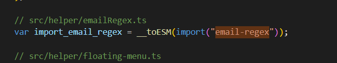

# nodejs

**安装高版本的nodejs**

- 安装地址` ` https://github.com/nodesource/distributions
- 介绍` `https://blog.csdn.net/love131452098/article/details/119740953

# nextjs

1、es规则版本

修改后：将require改成了import就好了

