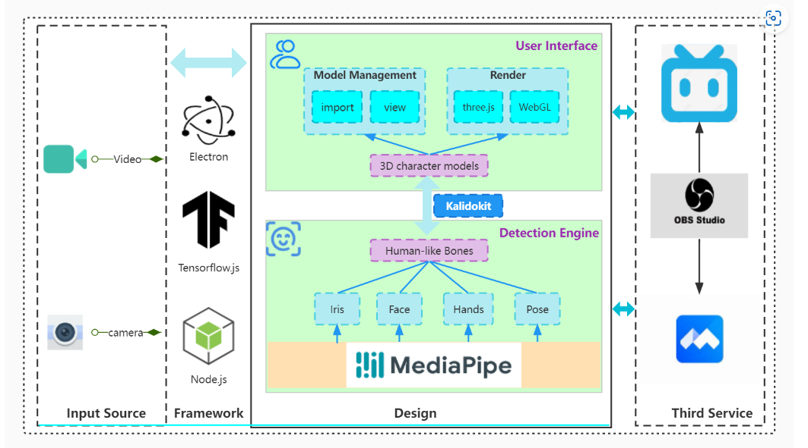

# 一个房间多个人物形象输入，同时驱动3D形象对战

# 通过浏览器中驱动不同虚拟形象

- 完成

# 需求设计与分析

## 模型选型

### mediaPipe

[官方文档](https://developers.google.com/mediapipe/solutions/vision/pose_landmarker/python)

1. *其生态较为完整，有face、pose、figer分别，较为精准的检测，提供pythn/js等多个版本*
2. *整体评估上，它为二维模型检测，在应用到3D模型上，可能有摇头晃脑的感觉*

### yolov7

[yolov7与mediapipe的对比](https://zhuanlan.zhihu.com/p/586932710)

*其较为适合GPU检测与多人，速度会比较快。*

*mediapipe适合单人，cpu检测，速度较快。*

### tensorflow-models

[官方文档](https://tensorflow.google.cn/lite/examples/pose_estimation/overview?hl=zh-cn)

[使用示例，非常多姿态检测示例](https://github.com/tensorflow/tfjs-models/tree/master/pose-detection/demos#live-camera-demo)

    *其胜在速度较快，有两代模型，可在手机上运行，提供web、安卓、ios等多个版本*

* **下面的ID，即为js中姿态检测中的ID，在计算3D旋转时，用这些ID**


#### **MoveNet：超快且准确的姿态检测模型**

[python使用手册](https://tensorflow.google.cn/hub/tutorials/movenet?hl=zh-cn)

 🎈可以考虑与live2d，2d模型相结合构建这块及时生成

### easymocap

*3D姿态检测，集成了前人的经验，包括上面提到的 tensorflow的一些成果。**在实现tesorflow的成果后，再加入这个模型。***

[github地址](https://github.com/zju3dv/EasyMocap)

## 基础代码选型

### sysmocap

#### 技术剖析

*目前看来，使用起来还比较慢，可能部署在后端高端服务器上，通过页面访问，会比较nice*

- 算法选型
  - mediapipe
- 技术栈
  - js
  - el 桌面端应用

## 本次目标构建

* [ ] **真人3D形象驱动**
* [ ] 真人2D形象驱动 live2d
* [ ] 2D自驱动
* [ ] 3D自驱动

### 首要目标

**✨真人3D形象驱动**

    *vrm虚拟形象基本已完成构建*

### 真人3D形象驱动实现思路

#### 3D形象加载与驱动

* [ ] web页面展示摄像头与虚拟形象
* [ ] 3D面部表情
  * [ ] mocap
  * [ ] 驱动3D形象
* [ ] 3D肢体驱动
  * [ ] mocap
  * [ ] 驱动3D形象
* [ ] 3D整体形象驱动
  * [ ] mocap
  * [ ] 驱动3D形象

#### VRM 3D形象驱动web制作

*VRM:   VRM 是专注于人型的 3D 文件格式。与 FBX 等 3D 格式最大的不同，在于 VRM 统一了各模型的坐标系、骨骼、表情等信息，使得模型使用起来更加方便，模型间的互换性也更好。除此之外，VRM 还提供了 Toon Shader，弹簧骨骼以及碰撞等组件，大大提高了我们的开发效率。可用VRoid Studio 进行模型制作。*

* **使用工具**
  * kalidokit  骨骼映射计算
  * vue工程构建

#### 开源算法分析

##### kalidoface-3d



**[项目跑通参考](https://blog.csdn.net/qq_20373723/article/details/122336778)**

* 项目参考材料
  * [算法简单分析](https://www.bilibili.com/read/cv14139422)
  * 使用其制作新的小工具，做人物打点计算 [打点计算](https://www.jianshu.com/p/15b8d3a82fcc)

**已完成项目部署，未作修改**

* [体验地址](https://47.106.181.184:4174)
* 
* 启动时修改了0.0.0.0，以及https启动

  ```js
   "serve": "vite preview --host 0.0.0.0 --https"
  ```

**项目功能探索**

* [X] 支持vrm模型导入
* [X] 支持3D、2D背景修改处理
* [ ] 支持多人虚拟场景通话
* [X] 支持OBS直播，换背景
  * [X] 使用win录屏功能 [参考连接](https://www.youtube.com/watch?v=Q1LltIBhzCI)
  * [ ] 使用B站直播，观察解决延迟，在网站到obs，几乎没有延迟
* [X] 多人同房间共享屏幕
  * [X] 使用zoom会议系统，进行屏幕共享，然后再开启直播连接

## 更高级的多摄像头捕捉人物，并驱动形象

### 模型探索选型

#### freemocap

#### easymocap

# 开发过程中的问题

## 前端

* [vue项目，es语法检测去除](https://blog.csdn.net/yingshuangtu/article/details/122104366)


关于团队辩论赛

- 放在服务器，多机器可以使用
- obs直播方式
- 实时改变音色

# 参考材料

* [3D绑定及人脸检测-简书博客](https://www.jianshu.com/p/15b8d3a82fcc)
* [kalidokit-github](https://github.com/yeemachine/kalidokit) KalidoKit  能适配mediapipe、tensorflow.js追踪的打点、然后动态计算VRM、live2d模型的位置，从而完成驱动虚拟形象。
* [系列动捕工具介绍](https://zhuanlan.zhihu.com/p/560371981?utm_campaign=shareopn&utm_medium=social&utm_oi=1572584264532709376&utm_psn=1646653438628028417&utm_source=wechat_session)
* [live2D虚拟人物生成项目： talking-head-anime-demo](https://github.com/pkhungurn/talking-head-anime-demo)
